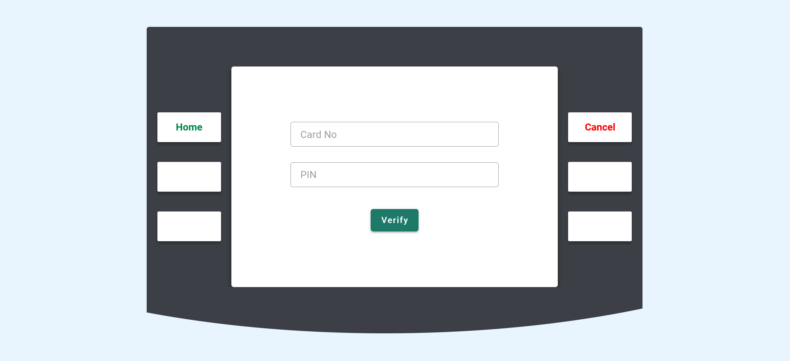

# ATM Application


This project is an ATM application that allows users to perform basic banking operations such as deposits and withdrawals. The backend is built using .NET Core Web API, and the frontend is created using Vue.js and Vuetify.
 
[FrontEnd - Live](https://d2zh494qsc92g7.cloudfront.net)
<br>
[Backend (Swagger) - Live](https://atmappwebapigenspark.azurewebsites.net/swagger/index.html)
 <br/>
[Frontend - Repo](https://github.com/Bharath-designer/atm-frontend)
 <br/>
[Backend - Repo](https://github.com/Senthamil2003/AtmManagerPresidio)
 
**Team Members**
- Aman Agrawal
- Bharath
- Jaivignesh
- Sanjai Ragul
- Senthamil Chezhian

## Preview

**[Demo Link](ATM_Screen_Recording.mp4)**

[](ATM_Screen_Recording.mp4)


## Features
 
1. **Deposit**
2. **Withdrawal**
3. **Check Balance**
4. **Bank History**
 
### Constraints
 
- A person cannot withdraw an amount if their account balance is less than the withdrawal amount.
- A person cannot withdraw more than 10,000 at one go.
- A person cannot deposit more than 20,000 at one go.
 
## Technologies Used
 
- **Backend:** .NET Core Web API
- **Frontend:** Vue.js, Vuetify
- **Database:** MSSQL , Entity Framework Core (using in-memory database for simplicity)
 
## Prerequisites
 
- .NET Core SDK
- Node.js
- Vue CLI
 
## Getting Started
 
### Clone the Repository
 
```bash
git clone https://github.com/JaivigneshJv/atm-application.git
cd atm-application
```
 
### Backend Setup
 
1. Navigate to the `AtmApplicationApp` folder.
 
```bash
cd AtmApplicationApp
```
 
2. Restore the .NET dependencies.
 
```bash
dotnet restore
```
 
3. Build the project.
 
```bash
dotnet build
```
 
4. Run the application.
 
```bash
dotnet run
```
 
The backend API will be available at `https://localhost:5001`.
 
### Frontend Setup
 
 ```bash
git clone https://github.com/Bharath-designer/atm-frontend.git
```


1. Navigate to the `frontend` folder (you might need to create this based on your project structure).
 
```bash
cd frontend
```
 
2. Install the npm dependencies.
 
```bash
npm install
```
 
3. Serve the frontend application.
 
```bash
npm run serve
```
 
The frontend application will be available at `http://localhost:8080`.
 
## API Endpoints
 
### Authentication
 
- **POST** `/api/Atm/Login`
  - Request Body:
    ```json
    {
      "cardNumber": "long",
      "pin": "int"
    }
    ```
  - Responses:
    - **200** (Success):
      ```json
      {
        "code": "int",
        "message": "string",
        "token": "string"
      }
      ```
    - **401** (Unauthorized):
      ```json
      {
        "message": "string",
        "code": "int"
      }
      ```
 
### Transactions
 
- **POST** `/api/Atm/DepositMoney`
  - Parameters:
    - **Query Parameter** `amount` (required, integer):
      ```json
      {
        "amount": "integer"
      }
      ```
  - Responses:
    - **401** (Unauthorized):
      ```json
      {
        "message": "string",
        "code": "int"
      }
      ```
 
- **POST** `/api/Atm/WithdrawMoney`
  - Parameters:
    - **Query Parameter** `amount` (required, number):
      ```json
      {
        "amount": "number"
      }
      ```
  - Responses:
    - **401** (Unauthorized):
      ```json
      {
        "message": "string",
        "code": "int"
      }
      ```
 
- **POST** `/api/Atm/CheckBalance`
  - Responses:
    - **200** (Success):
      ```json
      {
        "balance": "number",
        "userName": "string",
        "accountNumber": "long"
      }
      ```
    - **401** (Unauthorized):
      ```json
      {
        "message": "string",
        "code": "int"
      }
      ```
 
### Account Information
 
- **GET** `/api/Atm/GetTransaction`
  - Responses:
    - **200** (Success):
      ```json
      [
        {
          "transactionID": "int",
          "transactionType": "string",
          "transactionAmount": "number",
          "transactionDateTime": "string",
          "transactionDescription": "string",
          "accountNumber": "long"
        }
      ]
      ```
    - **401** (Unauthorized):
      ```json
      {
        "message": "string",
        "code": "int"
      }
      ```
 
---
 
## Database Seed Data
 
The application seeds the database with the following data:
 
### Customers
 
| UserId | Name | Phone      | Email          |
|--------|------|------------|----------------|
| 101    | John | 1234567890 | john@gmail.com |
| 102    | Ram  | 1234567890 | ram@gmail.com  |
| 103    | Bimu | 1234567890 | bimu@gmail.com |
| 104    | Himu | 1234567890 | himu@gmail.com |
| 105    | Somu | 1234567890 | somu@gmail.com |
 
### Accounts
 
| AccountNumber | Balance | UserId |
|---------------|---------|--------|
| 12345678901   | 52000   | 101    |
| 09876543210   | 98000   | 102    |
| 98765432198   | 78000   | 103    |
| 23456987623   | 91000   | 104    |
| 76575687653   | 88000   | 105    |
 
### Cards
 
| CardNumber | PIN  | AccountNumber |
|------------|------|----------------|
| 1234569791882006| 4466 | 12345678901    |
| 1234569791882007| 5782 | 09876543210    |
| 1234569791882008 | 1289 | 98765432198    |
| 1234569791882009| 2522 | 23456987623    |
| 1234569791882001| 7319 | 76575687653    |
 
## Constraints Handling
 
- Withdrawals and deposits are handled in the API to enforce the constraints on the amount.
- Appropriate HTTP status codes and messages are returned for constraint violations.